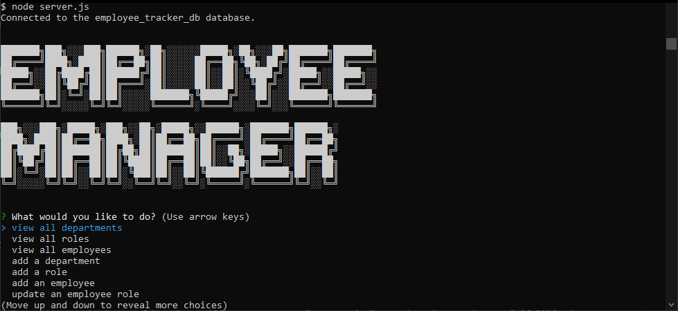

# Team-Profile-Generator

## Description

This is an application that interfaces with a MySQL database to build a relatioship between emloyees, departments and their roles 

Through the main menu, the user is asked what they woud like to do.
- There are several options
    - view all departments, 
    - view all roles, 
    - view all employees, 
    - add a department, 
    - add a role, 
    - add an employee, 
    - update an employee role, 
    - update employee managers, 
    - view employees by manager, 
    - view employees by department, 
    - delete a department, 
    - delete a role, 
    - delete an employee, 
    - view department utilization

<br>

## Table of Contents

- [GitHub Link](#link)
- [Installation Instructions](#install-instructions)
- [Executing Instructions](#executing-instructions)
- [Database Information](#database-information)
- [Video Demo](#video-demo)
- [Screen Shots](#screen-shots)
---

## Link

The link to the GitHub repository of the assignment is <br>
[https://github.com/jkoufalas/Employee-Tracker](https://github.com/jkoufalas/Employee-Tracker)

---

## Install Instructions

The dependancies are listed within the package.json file. The dependancies for this application are
 - inquirer@8.2.4
 - dotenv
 - mysql2

Since the dependancies are listed within the lock file, they will autmatically installed with the following command

```
npm i
```
---

## Executing Instructions

```
node index.js
```

Utilize the command prompts and the application will prompt you for any information it needs to fullfill the requests you have made.

---

## Database Information
The user must have a MySQL database installed on the machine they are running the application on.

The schema for the database is included in the db folder and can be included by running the command
```
mysql> source db/schema.sql
```

The seed data if required can be inserted into the database by using the seeds.sql file in the db folder and inserted by running the command.
```
mysql> source db/seeds.sql
```

The information used to connect to the database is currently implemented with the dotenv package. To include the correct information to connect to the database corretly the following the user needs to create a .env file and add the following data.
```
    DB_NAME="employee_tracker_db"
    DB_PASSWORD="your_password"
    DB_USER="your_user"
```
If the user doesn't want to use the dotenv package, then they can simply replace these variable in the server.js file with the hard coded values that these variables are storing.

---
## Video Demo

[Link to Demo](https://youtu.be/vhIIxC-qzC0)

Select the 1080p option for better resolution of text.

The demonstration video covers the following. 
- The install instructions.
- How to run the application.
- A walkthrough of the application and sample responses to questions.
---

## Screen Shots



---